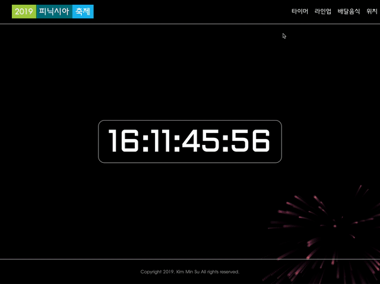

# 2019 피닉시아 축제 소개 페이지

   

##  [김민수](https://github.com/alstn2468)
## [ [Facebook](https://www.facebook.com/profile.php?id=100003769223078) ] [ [Github](https://github.com/alstn2468) ] [ [LinkedIn](https://www.linkedin.com/in/minsu-kim-336289160/) ] [ [Blog](https://alstn2468.github.io/) ] 

## 개요
**ReactJS**를 사용해 구현한 **순천향대학교 축제(피닉시아)** 소개 홈페이지 입니다.

## To Do List
- [x] 축제 시간 타이머
- [x] 불꽃 놀이 이펙트
- [ ] 라인업 정보
- [ ] 교통 정보 
- [ ] 부스 위치 정보

## Demo Image
